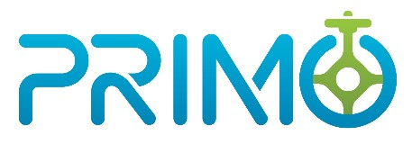

<!--  -->
</img>

# PRIMO - The P&A Project Optimizer Toolkit

PRIMO - The P&A Project Optimizer Toolkit aims to provide multi-scale, simulation-based, open source
computational tools and models for well plugging projects to support the National Energy Technology Laboratory (NETL).

## Project Status
[](https://pypi.org/project/primo-optimizer/)
[](https://pypi.org/project/primo-optimizer/)
[](https://github.com/PRIMO-optimizer/primo-codebase/actions/workflows/checks.yml)
[](https://codecov.io/gh/PRIMO-optimizer/primo-codebase)
[](https://github.com/psf/black)
[](https://pycqa.github.io/isort/)
[](https://primo.readthedocs.io/en/latest/?badge=latest)
[](https://github.com/PRIMO-optimizer/primo-codebase/contributors)
[](https://github.com/PRIMO-optimizer/primo-codebase/pulls?q=is:pr+is:merged)
[](https://isitmaintained.com/project/PRIMO-optimizer/primo-codebase)
[](https://pepy.tech/project/primo-optimizer)

## Getting Started

Our complete documentation is available on [readthedocs](https://primo.readthedocs.io/en/latest/), but here is a summarized set of steps to get started using the framework.

While not required, we encourage the installation of [Anaconda](https://www.anaconda.com/products/individual#Downloads) or [Miniconda](https://docs.conda.io/en/latest/miniconda.html) and using the `conda` command to create a separate python environment in which to install the PRIMO Toolkit.

Regular users can use conda to create a new "primo" environment.
```bash
conda env create -f conda-env.yml
```

This creates a new conda environment with the name "primo" that comes installed with all required dependencies to solve PRIMO's optimization problems.

Developers can create a new "primo" environment by executing:
```bash
conda env create -f conda-env-dev.yml
```

Activate the new environment with:
```bash
conda activate primo
```

To test the installation of the primo package, execute:
```
pytest primo\utils\tests\test_imports.py
```
The above test, if executed successfully, confirms that primo package is now installed and available in the "primo" package that was just created.

To use the utilities implemented in the PRIMO package that query the U.S. Census API, an appropriate API key must be obtained
by signing up with the respective service. These keys must be configured in a .env file in the parent directory. For more details, please see:
[API Keys](https://primo.readthedocs.io/en/latest/method/api_keys.html)

Additionally, use of [elevation based utilities](https://primo.readthedocs.io/en/latest/Utilities/elevation_utils.html) requires the user to provide a GeoTIFF file that provides elevation data across the region of interest. Users can download this data from [USGS Science Data Catalog](https://data.usgs.gov/datacatalog/data/USGS:35f9c4d4-b113-4c8d-8691-47c428c29a5b). For more details, please see:
[Elevation Data]((https://primo.readthedocs.io/en/latest/method/elevation.html))

Users can also employ other commercial solvers, for example Gurobi, to solve the optimization problem. 
However, users are responsible for configuring and setting up these solvers themselves.

## Running PRIMO with Binder

You can run PRIMO with [Binder](https://mybinder.org): a public cloud service that provides a temporary and short-lived sandbox environment to run PRIMO without installing any software locally.

### Quickstart

You can launch the Binder environment by clicking on the following badge: [](https://mybinder.org/v2/gh/PRIMO-optimizer/primo-codebase/main?labpath=primo%2Fdemo%2F)

### Key Notes

* Binder environments are automatically destroyed after a [few minutes of inactivity](https://mybinder.readthedocs.io/en/latest/about/user-guidelines.html#how-long-will-my-binder-session-last). To avoid lost work, please download the notebook file on your local machine periodically.
* The Binder provided environment is **public and insecure**. Please do not use this environment to work with sensitive data.

## Funding acknowledgements

This work is funded by DOE program grant DE-FOA-003109.

## Contributing

**By contributing to this repository, you are agreeing to all the terms set out in the LICENSE.md and COPYRIGHT.md files in this directory.**
