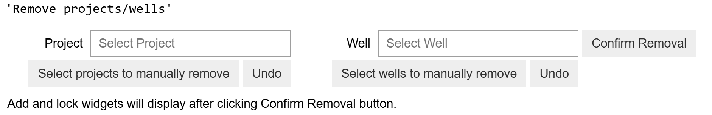
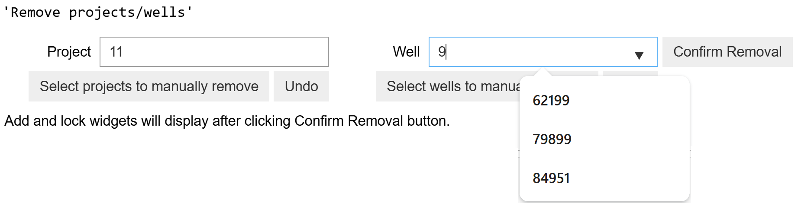
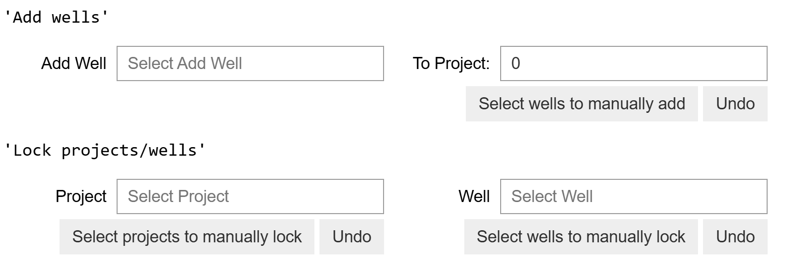
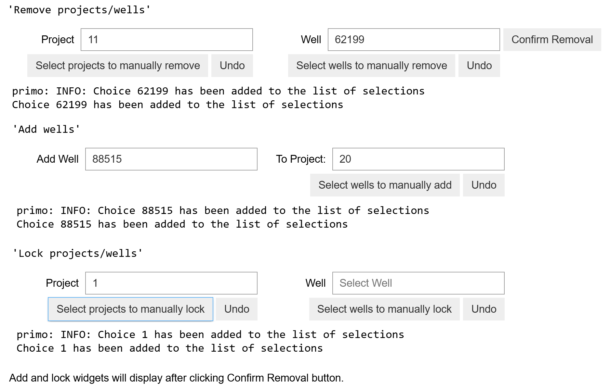
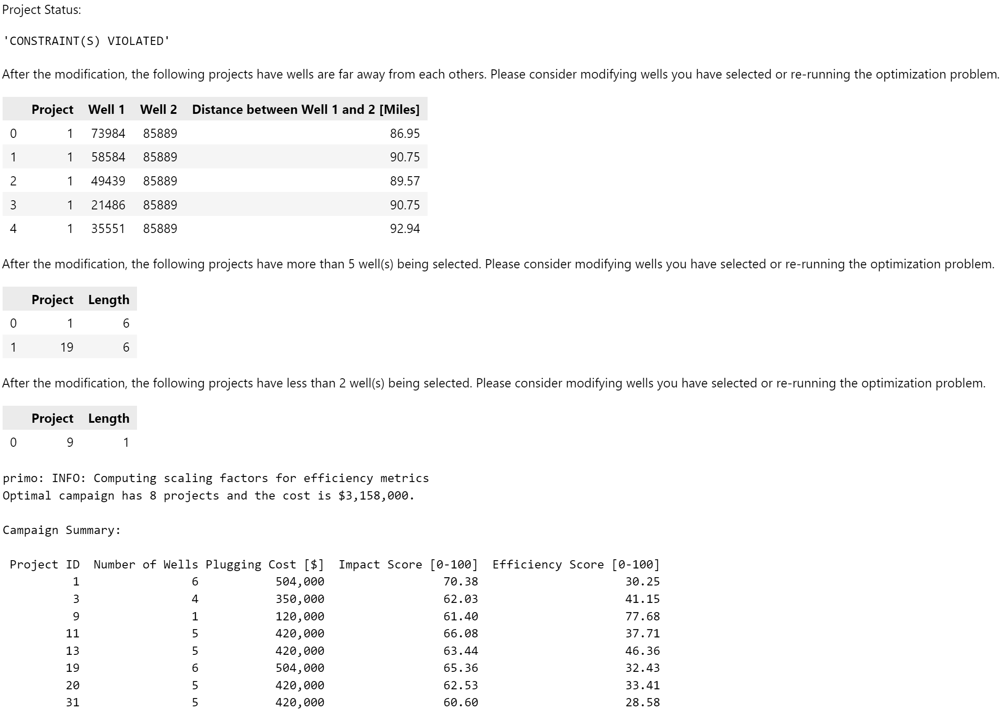
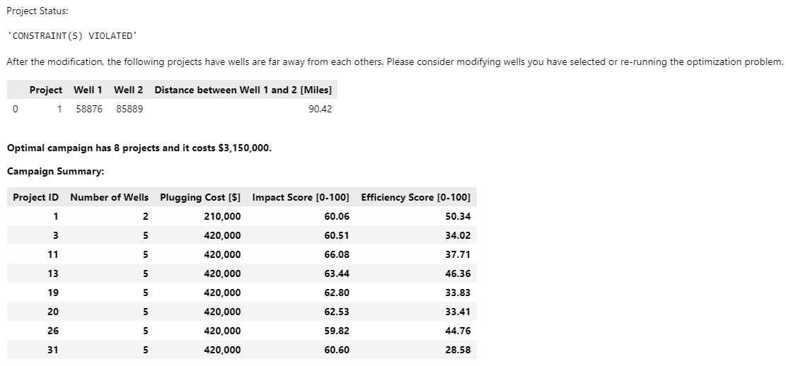

Override Feature
================

Overview
--------

The override feature allows users to modify the P&A projects recommended by PRIMO. The override capabilities can be useful if users want to experiment by manually tweaking PRIMO results and understand their impact on key outcomes.

Using the override feature, users can perform the following actions on the recommended results through the Jupyter Notebook:

- **Add** individual well(s) to one or more projects
- **Remove** individual well(s) from project(s)
- **Lock** individual well(s) within specific projects to preserve them during re-optimization
- **Reassign** individual well(s) from one project to a different project
- **Remove** entire project(s)
- **Lock** entire project(s) to preserve them during re-optimization

An example of the notebook can be found as the following:

`PRIMO - Example_1 <https://github.com/PRIMO-optimizer/primo-codebase/blob/main/primo/demo/PRIMO%20-%20Example_1.ipynb>`_

Currently, the override feature supports two distinct capabilities: recalculation and re-optimization.

- **Recalculation**: After a user makes changes via the override feature, this function recalculates the impact score and efficiency score for the modified projects based on the updated well selections. Projects and wells that were not modified are retained without changes.
- **Re-optimization**: This function integrates the user's override selections and re-runs the optimization problem to search for a new, feasible set of project assignments that adhere to the constraints (e.g., the maximum number of wells in a project). Note that this process may result in a solution that is **significantly different** from the original recommendation; however, the solution satisfies all override selection made by users (e.g., a well added to project 1 will be in project 1 in the re-optimization solution.)

How to Use the Override Widget
------------------------------

To modify the P&A projects using PRIMO’s override feature, follow the steps below by interacting with the corresponding widgets to provide your override selections:

- Step 1 - Remove Widget: This widget allows you to remove projects and/or wells from the P&A projects, as shown in :numref:`remove_widget`.
    - Remove projects: 
        - Type the number of the P&A project that should be removed in the "Project" textbox. The textbox has auto-fill feature to ease the effort of manual entry, as shown in :numref:`remove_widget_autofill`.
        - Select the project from the dropdown list.
        - Confirm the selection by clicking the "Select projects to manually remove" button. 
        - To remove another project, repeat the previous three steps.
        - To withdraw a selection, click the "Undo" button next to the "Select projects to manually remove" button.
    - Remove wells: 
        - Type the project number that the well belongs to in the "Project" textbox to narrow down the well selection. There is no need to click the "Select projects to manually remove" button.
        - Type the well number in the "Well" textbox. The textbox has auto-fill feature to ease the effort of manual entry.
        - Select the well from the dropdown list.
        - Confirm the selection by clicking the "Select wells to manually remove" button.
        - To remove another well, repeat the previous four steps.
        - To withdraw a selection, click the "Undo" button next to the "Select wells to manually remove" button.
        - **Important**: If any recommended wells need to be reassigned to a different project, remove them before proceeding to the next step.
    - Once you are satisfied with your selections, please press the "Confirm Removal" button to proceed to the next step that will display the "Add widget" and "Lock widget", as shown in :numref:`add_lock_widget`.

.. _remove_widget:
    

    Widget for removing wells and projects

.. _remove_widget_autofill:
    

    Widget for removing wells and projects with auto-fill feature being displayed

.. _add_lock_widget:
    

    Widget for adding wells and locking wells and projects

- Step 2 - Add Widget: This widget allows you to add wells to projects or reassign wells to different projects. 
    - Add wells to projects:  
        - Type the well number in the "Add Well" textbox. The textbox has auto-fill feature to ease the effort of manual entry.
        - Select the well from the dropdown list. The default project that the well belongs to will appear in the "To Project" textbox. 
            - If you do not want to change the project for the well, please leave the "To Project" textbox as is.
            - If you want to assign the well to a different project, type the new project number in the "To Project" textbox. Note that this textbox does not have an auto-fill feature, so you must type the entire project number.
        - Confirm the selection by clicking the "Select wells to manually add" button.
        - To add additional wells, repeat the previous three steps.
        - To withdraw a selection, click the "Undo" button next to the "Select wells to manually add" button.
    - Reassign a recommended well to a different project:
        - Please ensure the well has been removed in Step 1.
        - Follow the steps outlined under "Add Wells to Projects."

- Step 3 - Lock Widget: This widget is for locking wells and/or projects in the P&A projects during the re-optimization step. Please note that locking wells and/or projects does not affect the recalculation results.
    - Lock projects: 
        - Type the number of the P&A project that should be locked in the "Project" textbox. The textbox has auto-fill feature to ease the effort of manual entry.
        - Select the project from the dropdown list.
        - Confirm the selection by clicking the "Select projects to manually lock" button. 
        - To lock another project, repeat the previous three steps.
        - To withdraw a selection, click the "Undo" button next to the "Select projects to manually lock" button.
    - Lock wells: 
        - Type the project number that the well belongs to in the "Project" textbox to narrow down the well selection. There is no need to click the "Select projects to manually lock" button.
        - Type the well number in the "Well" textbox. The textbox has auto-fill feature to ease the effort of manual entry.
        - Select the well from the dropdown list.
        - Confirm the selection by clicking the "Select wells to manually lock" button.
        - To lock another well, repeat the previous four steps.
        - To withdraw a selection, click the "Undo" button next to the "Select wells to manually lock" button.

There will be a message displayed under the widget for each well and project being removed, added, or locked to help to help track the modifications that have been made so far, as shown in :numref:`override_widget`.

.. _override_widget:

    Widget for adding wells and locking wells and projects

.. note::
    - Please **only** select projects or wells from the **dropdown list** (except for the "To Project" textbox in the Add widget). Projects and wells **not listed** in the dropdown are **invalid** and will cause errors in subsequent steps if selected. 
    - Once you click the "Confirm Removal" button, you will not be able to modify the projects and wells selected for removal. If you need to make changes, please re-execute the previous cell to restart your selection.
    - If you do not want to remove, add, or lock any projects or wells, please leave the corresponding widget blank.
    - Override selections must be made separately for each type of well project: gas well, oil well, and combined well.

Recalculation
-------------
The recalculation function computes updated impact scores and efficiency scores for each project after user modifications have been made. These projects represent a combination of P&A projects that PRIMO originally recommended and the changes applied through user overrides.
It guarantees that:

- Wells/projects added will be included in the recalculation solution
- Wells/project removed will not be included in the recalculation solution
- Wells/projects recommended in the original solution but not modified through override will be included in the recalculation solution

.. note::
    Locking wells/projects does not affect the recalculation solution.

Each recalculated project's priority score is computed as the average priority score of the wells it contains. Since the override process allows for manual edits, some user-specified constraints may be violated. 
Information on these violations is displayed alongside the updated impact and efficiency scores, as shown in :numref:`recalculation_violation`. The efficiency score is calculated using the same methodology described in the 
:ref:`Project Efficiency Score Calculation <project-efficiency-score>` section.

.. _recalculation_violation:
    

    Constraint violations for projects modified through user override

Re-optimization
---------------
The re-optimization feature of the override generates a set of **new P&A project recommendations** based on the user’s override selections. This involves re-solving the underlying optimization problem to find an alternative solution that 
satisfies user-defined constraints (e.g., the maximum number of wells in a project) as closely as possible. It guarantees that:

- Wells/projects added will be included in the re-optimization solution
- Wells/project removed will not be included in the re-optimization solution
- Wells/projects locked will be included in the re-optimization solution

For wells/projects that are not added, removed, or locked, regardless of whether they are in the original recommendation or not, their inclusion in the re-optimization solution will be determined by solving the optimization problem. Therefore, the newly generated projects may differ from:

- The original recommendations by PRIMO, and
- The manually adjusted projects from the recalculation step.

However, because the optimization model actively enforces constraints, re-optimized results typically violate fewer (or no) constraints than recalculated ones — except in unavoidable cases. 
For example, if a user manually adds a well to a distant project and locks that project, the maximum distance between two well pairs constraint will be violated in the solution. 
Information about constraint violations is also provided to users, as shown in :numref:`re_optimization_violation`.

To preserve specific wells or projects in the final solution, users should utilize the “Lock wells” and “Lock projects” through the Lock Widget.

.. _re_optimization_violation:
    

    Constraint violations in re-optimized projects based on the user override selection

Optimization Model
^^^^^^^^^^^^^^^^^^
The override re-optimization function re-solves the optimization problem to generate a new set of P&A project recommendations that best meet user-defined constraints while incorporating the user’s override selections. For more details on the optimization mode, please see the :ref:`Optimization Model for Override Re-optimization <override_re_optimization_model>` section. 

